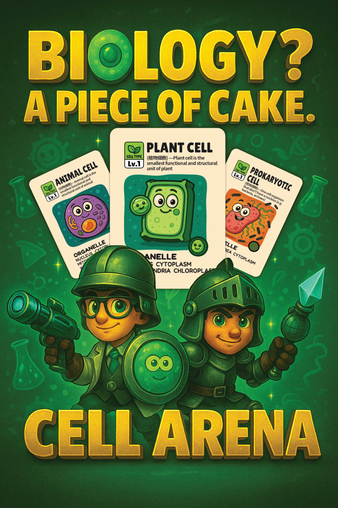

# Cell Arena ATP Counter

A simple mobile-friendly web tool for tracking ATP and Glucose levels in a biology-themed game environment.

🌐 **Live Demo**: [Visit Now](https://sciarenalabs.com)

## Features

- 🔋 Track ATP and Glucose for multiple players
- 🎮 Leaderboard and turn tracker
- 📱 Add to Home Screen support (iOS & Android PWA)
- 🎨 Custom icons, responsive UI

## How to Use

1. Open [sciarenalabs.com](https://sciarenalabs.com) on your mobile device.
2. Add to Home Screen (iOS: Safari, Android: Chrome).
3. Launch and enjoy full-screen app experience.

————————————————————————————————————————————————————

# Cell Arena ATP Counter 「Introduction」

### Creative Concept 
"Cell Arena: ATP Racing" is a card game that combines scientific education, strategic competition, and visual aesthetics. The game depicts the biological process of ATP (adenosine triphosphate) reactions, aiming to help children and teenagers understand cellular science, stimulate their interest in biology, and explore the micro world.

 ### Stimulating Scientific Curiosity 

Through the game design at the cellular level, players are guided to deconstruct cellular functions, from molecular processes to intercellular causal relationships.

Through interactive game design, this game incorporate foundational cellular metabolic concept tested in AP biology that will be useful for any levels of biological learning.

It promotes scientific literacy, supports interdisciplinary learning, and strengthens students’ foundations in STEAM education.

### Creative Motivation  

Hank and Eric, through their learning of traditional biology content, realized the difficulties students face when trying to understand cellular biology and molecular biology concepts. They were inspired by their love for science to create a card game that could spark interest and provide a deep interactive learning experience.

The game not only provides engaging content but also encourages students to visualize biological principles, laying a solid foundation for their future academic journeys.

### Creative Team 

Hank「G11 -（2024~2025）」
2025 USABO Top 20%
2024 BBO Gold Medal
2023 UKCHO Silver Medal

Eric 「G7 -（2024~2025）」
2025 USABO Top 20%
2025 IPC Gold Medal
2024 UKBC Gold Medal

···························
"Oooooooo, SciArena, victory is ours!"

